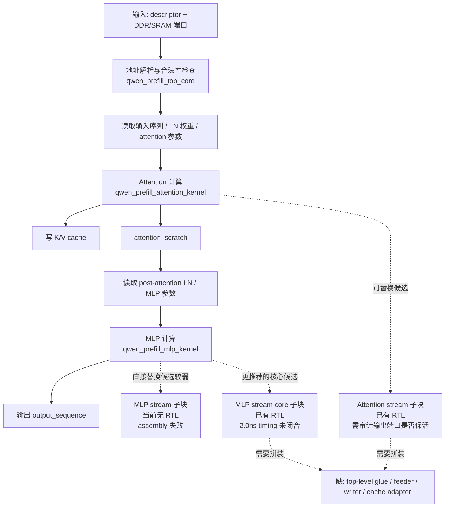

# Prefill 最小可用 Block 评估 2026-03-23

## 1. 结论

如果当前目标是尽快得到一个“计算完成”的 prefill block，优先路线建议是：

1. 不先继续投入 `catapult_prefill_mlp_stream`。
2. 优先基于 `attention_stream + mlp_stream_core` 做一个 glue top。
3. 把 `catapult_prefill_mlp_stream` 作为后续清理和收敛项，而不是当前主路径。

原因如下：

1. `catapult_prefill_mlp_stream` 当前还卡在 assembly，尚未生成 RTL。
2. `catapult_prefill_mlp_stream` 的问题集中在 wrapper/top 粒度，属于 HLS 结构性问题，不是简单调参可解。
3. `catapult_prefill_mlp_stream_core` 已经成功 extract 并导出 RTL，说明更细粒度的 MLP 核心已经可复用。
4. `qwen_prefill_attention_stream_top_catapult` 已经成功 extract，但当前日志里存在输出端口被优化掉的告警，仍需做一次接口有效性审计。
5. 从“最小可用 block”角度，glue top 缺的是外围装配件；而 `mlp_stream` 缺的是自身先活下来。

## 2. 两条路线的取舍

### 2.1 路线 A：先修 `catapult_prefill_mlp_stream`

优点：

1. 粒度更整齐，直接得到独立的 MLP stream block。
2. block 边界更高层，后续系统级拼接可能更直观。
3. 若修通，attention block 和 mlp block 的形态会更对称。

缺点：

1. 当前明确失败在 assembly，而不是 extract。
2. 已知问题包含：
   - `NL-21`：输出未能证明无条件赋值。
   - `LOOP-21`：对 fully-unrolled loop 施加 pipeline 约束。
3. 这类问题通常要改 wrapper 代码结构，而不是简单改约束。
4. 即使修通 assembly，后面还不一定能在 extract/timing 上顺利通过。
5. 当前 `mlp_stream` 采用“整块读入 + token loop 调 kernel”的风格，离硬件友好的最终拼装形态反而更远。

结论：

`catapult_prefill_mlp_stream` 更适合作为后续整理项，不适合作为当前最短路径。

### 2.2 路线 B：基于 `attention_stream + mlp_stream_core` 做 glue top

优点：

1. `attention_stream` 已有成功 extract 记录。
2. `mlp_stream_core` 已有成功 extract 记录。
3. 更贴近最后的分块硬件结构：前半段 attention，后半段 MLP core。
4. 可以把工作重点放在“块间连接与供数”上，而不是继续和 `mlp_stream` 的 wrapper 结构博弈。
5. 对“先做出一个可运行 block”更划算。

缺点：

1. 需要新写 glue top。
2. 需要补 tile feeder / stream adapter。
3. `mlp_stream_core` 目前虽然出 RTL，但 2.0ns timing 还未满足。
4. `attention_stream` 当前日志里存在输出端口被优化掉的告警，需要先确认导出的接口是否真的可用。

结论：

如果目标是“尽快得到最小可用 prefill 计算 block”，优先选这条路线。

## 3. 当前各模块状态

### 3.1 完整 prefill 顶层

- 模块：`qwen_prefill_top_catapult`
- 作用：完整 prefill 顶层入口
- 当前状态：还没有作为可交付 RTL block 收敛完成
- 说明：它内部依赖 attention 和 mlp 两段的常规 kernel 调用链，以及 descriptor / memory window / DDR 地址解析逻辑。

### 3.2 Attention stream 子块

- 模块：`qwen_prefill_attention_stream_top_catapult`
- 作用：把 prefill attention 部分包装成 stream top
- 当前状态：有 extract 成功记录
- 风险：当前日志中存在 `k_cache_out_chan`、`v_cache_out_chan`、`output_sequence_chan` 被优化掉的告警，需要审计导出接口是否真的保持有效

### 3.3 MLP stream 子块

- 模块：`qwen_prefill_mlp_stream_top_catapult`
- 作用：把 prefill MLP 部分包装成 stream top
- 当前状态：未成功生成 RTL
- 当前卡点：assembly 失败
- 已知问题：`NL-21`、`LOOP-21`

### 3.4 MLP stream core 子块

- 模块：`qwen_prefill_mlp_stream_core_catapult`
- 作用：更细粒度的 MLP 流式核心块
- 当前状态：已成功 extract 并生成 RTL
- 风险：当前 2.0ns timing 仍未闭合

## 4. 最小可用 Prefill Block 缺件清单

这里的“最小可用”定义为：

1. 输入完整 prefill 所需的 activation / weight / scale / 控制信息。
2. 完成 attention + MLP 两段计算。
3. 输出最终 prefill output sequence。
4. 正确处理 KV cache 写回。

按模块拆分，当前还缺这些部件。

### 4.1 顶层控制与参数模块

待做项：

1. `prefill_glue_top_catapult`
2. `descriptor/config decode`
3. `seq_len/rms_eps/error_code/done` 控制通路

职责：

1. 统一管理 top-level 端口。
2. 驱动 attention block 和 mlp block 的启动顺序。
3. 处理 block 级返回状态与错误码。

### 4.2 Attention 输入供数模块

待做项：

1. input sequence feeder
2. input layernorm weight feeder
3. Q/K/V/O packed weight feeder
4. Q/K/V bias feeder
5. Q/K/V/O scale feeder

职责：

1. 把外部 DDR/SRAM 数据转成 `attention_stream` 需要的 channel 形式。
2. 保证数据顺序、包宽和 token/head 组织与 `attention_stream_top` 接口一致。

### 4.3 Attention 输出承接模块

待做项：

1. attention residual / output sequence bridge
2. K cache writer
3. V cache writer

职责：

1. 接收 `attention_stream` 产出的 output sequence。
2. 把它转换为 MLP 侧 `attention_residual_chan` 的输入。
3. 把 attention 产生的 K/V cache 写入目标缓存接口。

### 4.4 MLP 输入 tile feeder 模块

待做项：

1. post-attention layernorm weight feeder
2. gate packed weight tile feeder
3. up packed weight tile feeder
4. down packed weight tile feeder
5. gate scale tile feeder
6. up scale tile feeder
7. down scale feeder

职责：

1. 将外部完整 MLP 参数切成 `mlp_stream_core` 所需 tile 流。
2. 保证 tile 顺序与 core 的 hidden/ff 双层遍历顺序匹配。

### 4.5 MLP 输出写回模块

待做项：

1. output sequence sink / writer

职责：

1. 把 `mlp_stream_core` 输出的 `output_sequence_chan` 转回最终 block 输出或 activation memory。

### 4.6 接口一致性审计模块

待做项：

1. `attention_stream` 导出接口有效性检查
2. `mlp_stream_core` 输入输出包序检查
3. attention 输出到 mlp 输入的数值一致性检查

职责：

1. 确认 extract 后接口没有被优化坏。
2. 确认 block 拼接后数值路径等价于当前 `top_core` 软件路径。

### 4.7 Timing/实现收敛模块

待做项：

1. `mlp_stream_core` timing 收敛
2. glue top 新增 feeder/bridge 后的时序复核
3. 必要时对 attention_stream 再做 timing 与端口保活修正

职责：

1. 把“能 extract”推进到“目标时钟下可实现”。

## 5. 推荐执行顺序

建议按下面顺序推进。

### 第一阶段：确认现有可复用块是否真的可接

1. 审计 `attention_stream` 的导出端口是否真的保留输出。
2. 固化 `mlp_stream_core` 当前接口文档。
3. 明确 `attention output_sequence` 到 `mlp attention_residual` 的包格式是否完全一致。

### 第二阶段：做最小 glue top

1. 先不碰完整 prefill descriptor 和 DDR 大接口。
2. 先做一个 channel 级 glue top，把 attention 子块和 mlp core 子块串起来。
3. 先用最小测试向量验证 attention 输出能被 mlp core 正确消费。

### 第三阶段：补 memory/控制包装

1. 加入权重和 scale feeder。
2. 加入 KV cache writer。
3. 加入 output writer。
4. 再决定是否把 descriptor / DDR window 管理并回完整 top。

### 第四阶段：最后再回头修 `mlp_stream`

1. 只有当需要一个更整洁、更对称的独立 MLP stream block 时，再去修 `catapult_prefill_mlp_stream`。
2. 它不应阻塞当前最小可用 block 主线。

## 6. 当前 `top_core` 的完整 Prefill 路径

下面这张图描述当前 `qwen_prefill_top_core` 的软件/算法路径，以及每一段当前是否已有可复用 RTL。

## 7. 模块状态总表

| 模块 | 功能位置 | RTL 状态 | 当前主要问题 | 是否适合当前主线 |
| --- | --- | --- | --- | --- |
| `qwen_prefill_top_catapult` | 完整 prefill 顶层 | 未收敛为可交付 block | 系统层太大 | 否 |
| `qwen_prefill_attention_stream_top_catapult` | attention 子块 | 已 extract | 输出端口保活需审计 | 是 |
| `qwen_prefill_mlp_stream_top_catapult` | MLP 子块 | 未 extract | `NL-21`、`LOOP-21` | 否 |
| `qwen_prefill_mlp_stream_core_catapult` | MLP 核心子块 | 已 extract | 2.0ns timing 未闭合 | 是 |

## 8. 最终建议

最终建议是：

1. 当前主线选择 `attention_stream + mlp_stream_core + glue top`。
2. 先把“最小可用计算 block”做出来，再回头修 `mlp_stream`。
3. 在 glue top 之前，优先补两项核查：
   - `attention_stream` 导出端口是否真的有效。
   - `mlp_stream_core` 的 tile 输入顺序是否已经可被稳定 feeder 驱动。

如果只允许优先做一件事，建议下一步是：

1. 先做 `attention_stream -> mlp_stream_core` 的接口/数据序桥接设计草案。
